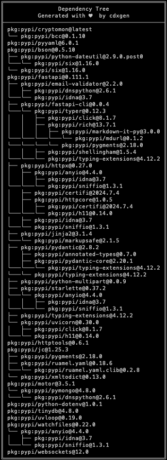
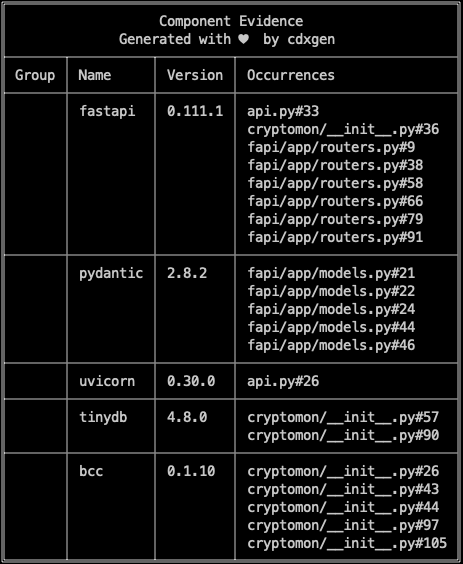
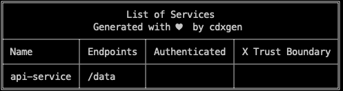
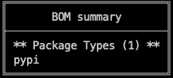

[](https://github.com/Santandersecurityresearch/CryptoMon/actions/workflows/github-code-scanning/codeql)
[](https://www.gnu.org/licenses/gpl-3.0)


# CryptoMon

Network Cryptography Monitor - using eBPF, written in python.

**NB - This code is pre-production and is intended for demonstration purposes.**

This is an demonstration service that allows the interception and analysis of over-the-wire TLS cryptography. 

Cryptomon looks for port 443 traffic, and if found, looks for the 'hello' packets from the client and server. It parses the packet data and then stores it in a MongoDB database that can later be analysed.

The advantage of using network monitoring alongside the [CodeQL Source Code analysis](https://github.blog/2023-12-05-addressing-post-quantum-cryptography-with-codeql/) we have worked on previously, is that static analysis of code tells you what could be running, whilst over-the-wire monitoring tells you what is actually being negotiated.

## What is supported

Currently we support the following protocols and captures:

* TLS Handshake data for all TLS versions, inc. proposed ciphersuites and accepted ciphersuites, across several ports:
  * 443 (https)
  * 990 (sftp)
  * 3389 (rdp)
  * 8080 (proxy)
  * 8443 (proxy)
* TLS Certificates - where they are complete and not affected by TCP fragmentation.
* SSH Handshakes - including kex, server algos, etc. 

**TODO features** include:

* SSH Key logging option
* IPv6 support

## Setup

This setup is designed to operate under Ubuntu 22.04 "jammy". 

Firstly, `git clone` this repository. The `ubuntu-setup.sh` script will install all the necessary files. 

If you wish to run this service all the time in the background, then you should look at running the `create-service.sh` script that creates a systemd service that continually monitors network traffic in the background. 

You will also need to make sure that mongodb is installed and running. Once this is done, you should connect to the instance with `mongosh` and run the following: 

```python
db.createCollection('cryptomon')
db.createUser({user: "cryptomonUser", pwd: passwordPrompt(), roles: [{ role: "readWrite", db: "cryptomon" }]})
```

This creates the `cryptomon` collection that the monitor will use to store information, as well as a read/write user for that database - this will prompt you to create a password.

Once this is done you may export these: 

```bash
export DB_URL="mongodb://cryptomonUser:<password>@<uri>:27017/cryptomon?retryWrites=true&w=majority"
export DB_NAME="cryptomon"
```

**OR** if you are using MongoDB Atlas or some other cloud service:

```bash
export DB_URL="mongodb+srv://<Connection URL>/cryptomon?retryWrites=true&w=majority"
export DB_NAME="cryptomon"
```

The `fapi/config/__init__.py` should pick these settings up. If, for whatever reason, these environment variables are not picked up, you can edit that file manually.

## Usage

Once everything is installed you can run the monitor and FastAPI with:

```bash
sudo python3 ./cryptomon.py -i <iface> &
python3 ./api.py
```

Where `<iface>` should be replaced with the network interface to be monitored (`enp0s1` by default.)

If you have installed `cryptomon` as a service, then you do not need to run the first line. To check the monitor is working you can run `db.cryptomon.count({})` from `mongosh` to see if the record count is increasing. 

## FastAPI 

To access the FastAPI documentation go to `http://0.0.0.0:8000/docs` to find the documentation for the backend API.

## Example Data

### TLS Capture

A TLS client capture example:

```json
{
"_id": "6682cd75393bb4e863fc0c65",
"eth": {
    "src": {
    "ipv4": "192.168.64.5"
    },
    "dst": {
    "ipv4": "3.210.189.242"
    }
},
"tls": {
    "tls_versions": [
    "TLSv1.3",
    "TLSv1.2"
    ],
    "ciphersuites": [
    "TLS_AES_128_GCM_SHA256",
    "TLS_CHACHA20_POLY1305_SHA256",
    "TLS_AES_256_GCM_SHA384",
    "TLS_ECDHE_ECDSA_WITH_AES_128_GCM_SHA256",
    "TLS_ECDHE_RSA_WITH_AES_128_GCM_SHA256",
    "TLS_ECDHE_ECDSA_WITH_CHACHA20_POLY1305_SHA256",
    "TLS_ECDHE_RSA_WITH_CHACHA20_POLY1305_SHA256",
    "TLS_ECDHE_ECDSA_WITH_AES_256_GCM_SHA384",
    "TLS_ECDHE_RSA_WITH_AES_256_GCM_SHA384",
    "TLS_ECDHE_ECDSA_WITH_AES_256_CBC_SHA",
    "TLS_ECDHE_ECDSA_WITH_AES_128_CBC_SHA",
    "TLS_ECDHE_RSA_WITH_AES_128_CBC_SHA",
    "TLS_ECDHE_RSA_WITH_AES_256_CBC_SHA",
    "TLS_RSA_WITH_AES_128_GCM_SHA256",
    "TLS_RSA_WITH_AES_256_GCM_SHA384",
    "TLS_RSA_WITH_AES_128_CBC_SHA",
    "TLS_RSA_WITH_AES_256_CBC_SHA"
    ],
    "EtM": false,
    "hostname": "ping.chartbeat.net",
    "groups": [
    "x25519",
    "secp256r1",
    "secp384r1",
    "secp521r1",
    "ffdhe2048",
    "ffdhe3072"
    ],
    "kex_group": "x25519",
    "sigalgs": [
    "ecdsa_secp256r1_sha256",
    "ecdsa_secp384r1_sha384",
    "ecdsa_secp521r1_sha512",
    "rsa_pss_rsae_sha256",
    "rsa_pss_rsae_sha384",
    "rsa_pss_rsae_sha512",
    "rsa_pkcs1_sha256",
    "rsa_pkcs1_sha384",
    "rsa_pkcs1_sha512",
    "ecdsa_sha1",
    "rsa_pkcs1_sha1"
    ]
},
"ptype": "client",
"ts": 1719848309.166212
}
```

A TLS server hello capture example:

```json
{
"_id": "6682cd75393bb4e863fc0c66",
"eth": {
    "src": {
    "ipv4": "3.210.189.242"
    },
    "dst": {
    "ipv4": "192.168.64.5"
    }
},
"tls": {
    "tls_versions": "TLSv1.2",
    "ciphersuite": "TLS_ECDHE_RSA_WITH_AES_128_GCM_SHA256"
},
"ptype": "server",
"ts": 1719848309.26233
}
```

## Software Bill of Materials (SBOM)

We are firm supporters of the SBOM movement, as it's a key building block in software security and software supply chain risk management. A SBOM is a nested inventory, a list of ingredients that make up software components and as such, here's our recipe:





