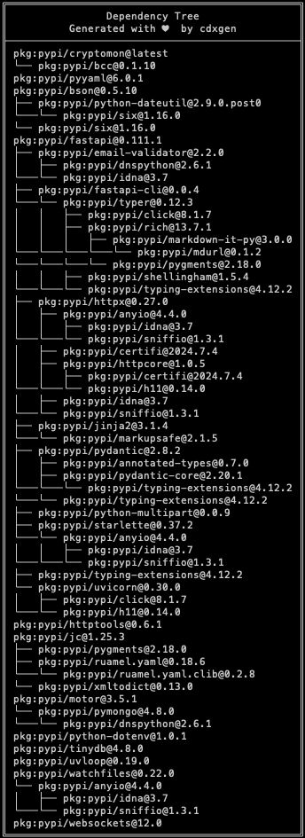
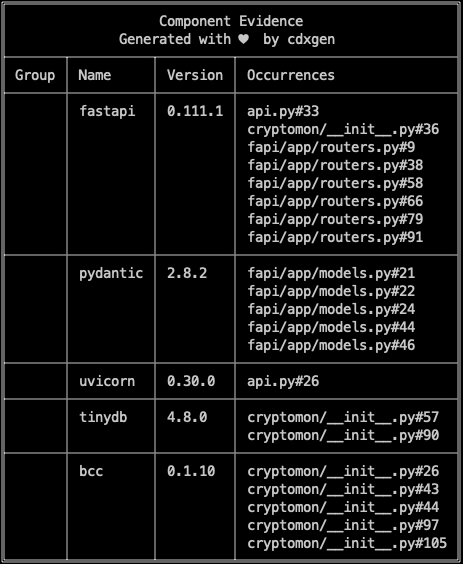
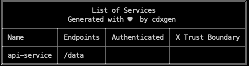
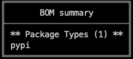

[](https://github.com/Santandersecurityresearch/CryptoMon/actions/workflows/github-code-scanning/codeql)
[](https://www.gnu.org/licenses/gpl-3.0)


# CryptoMon

Network Cryptography Monitor - using eBPF, written in python.

**NB - This code is pre-production and is intended for demonstration purposes.**

This is an demonstration service that allows the interception and analysis of over-the-wire TLS cryptography. 

Cryptomon looks for port 443 traffic, and if found, looks for the 'hello' packets from the client and server. It parses the packet data and then stores it in a MongoDB database that can later be analysed.

The advantage of using network monitoring alongside the [CodeQL Source Code analysis](https://github.blog/2023-12-05-addressing-post-quantum-cryptography-with-codeql/) we have worked on previously, is that static analysis of code tells you what could be running, whilst over-the-wire monitoring tells you what is actually being negotiated.

## What is supported

Currently we support the following protocols and captures:

* TLS Handshake data for all TLS versions, inc. proposed ciphersuites and accepted ciphersuites, across several ports:
  * 443 (https)
  * 990 (sftp)
  * 3389 (rdp)
  * 8080 (proxy)
  * 8443 (proxy)
* TLS Certificates - where they are complete and not affected by TCP fragmentation.
* SSH Handshakes - including kex, server algos, etc.

We support a local FastAPI service, as well as logging to file via `TinyDB` or logging to a NoSQL document DB using MongoDB.

**TODO features** include:

* SSH Key logging option
* IPv6 support

## Quick start with Docker

If you have Docker, you need none of the setup below.

```bash
docker build -f docker/Dockerfile.offline -t cryptomon-offline .

docker run --rm --network none --read-only \
    -v "$PWD:/captures:ro" cryptomon-offline /captures/your-capture.pcap
```

That prints what cryptography the handshakes in the capture negotiated: which
key exchanges would survive a quantum computer, which post-quantum offers the
server refused, and what is in the certificate chain. The image is 164MB, runs
as a non-root user with a read-only filesystem and no network at all, and
contains no database, no eBPF, no kernel headers and nothing from
`ubuntu-setup.sh`.

For the API, its browser upload UI and the dashboard, with a MongoDB beside it:

```bash
cd docker
cp env.example .env          # then put a real password in MONGO_PASSWORD
docker compose up --build    # http://127.0.0.1:8000/
```

Both ports bind `127.0.0.1`. The MongoDB password that ships in
`docker/compose.yaml` is `change-me-this-is-not-a-password` — a placeholder
written out in full so it cannot be mistaken for a generated secret.

The live eBPF sensor is a third image and an opt-in compose profile, because
it needs host networking and elevated capabilities. To find out whether eBPF
works on your machine at all:

```bash
docker build -f docker/Dockerfile.sensor -t cryptomon-sensor .
docker run --rm --cap-add BPF cryptomon-sensor
```

```
OK    compiles
OK    verifies as SOCKET_FILTER (fd=5)
OK    verifies as SCHED_CLS (fd=5)
```

Then `SENSOR_IFACE=eth0 docker compose --profile sensor up`. See
`docker/README.md` for the capability list, what the host must provide, and
why `--privileged` is the lazy answer rather than the right one.

## Setup

This installs CryptoMon directly on a host, under Ubuntu 24.04 "Noble
Numbat". If you would rather not install anything, the containers above do
all of this and need none of it. 

Firstly, `git clone` this repository. The `ubuntu-setup.sh` script will install all the necessary files. 

If you wish to run this service all the time in the background, run
`create-service.sh`. It installs two systemd units -- the sensor, which
needs `CAP_BPF` and a network interface, and the API, which needs
neither -- and starts neither of them, so that you can read the unit
files and put the database password in place first. `deploy/README.md`
walks through that, and through putting the service behind nginx on a
subpath. 

You will also need to make sure that mongodb is installed and running. Once this is done, you should connect to the instance with `mongosh` and run the following: 

```python
use cryptomon
db.createCollection('cryptomon')
db.createUser({user: "cryptomonUser", pwd: passwordPrompt(), roles: [{ role: "readWrite", db: "cryptomon" }]})
```

This creates the `cryptomon` collection that the monitor will use to store information, as well as a read/write user for that database - this will prompt you to create a password.

Once this is done you may export these: 

```bash
export DB_URL="mongodb://cryptomonUser:<password>@<uri>:27017/cryptomon?retryWrites=true&w=majority"
export DB_NAME="cryptomon"
```

**OR** if you are using MongoDB Atlas or some other cloud service:

```bash
export DB_URL="mongodb+srv://<Connection URL>/cryptomon?retryWrites=true&w=majority"
export DB_NAME="cryptomon"
```

The `fapi/config/__init__.py` should pick these settings up. If, for whatever reason, these environment variables are not picked up, you can edit that file manually.

## Usage

Once everything is installed you can run the monitor and FastAPI with:

```bash
sudo python3 ./cryptomon.py -i <iface> &
python3 ./api.py
```

Where `<iface>` should be replaced with the network interface to be monitored (`enp0s1` by default.)

If you have installed `cryptomon` as a service, then you do not need to run the first line. To check the monitor is working you can run `db.cryptomon.count({})` from `mongosh` to see if the record count is increasing. 

## PCAP Files

```bash
python3 -m pcapscan test.pcap
```

`pcapscan` reads the capture directly. It needs no root, no eBPF, no
interface and no database, and it runs on any platform Python does.

It also sees considerably more than the live monitor can. The eBPF path
receives one packet at a time, so it can only read a handshake that starts at
the beginning of a TCP payload and finishes inside the same packet. `pcapscan`
reassembles the stream first, which means:

* **Whole ClientHellos.** A modern hello with post-quantum key shares is
  around 1.9KB and arrives in two segments; the live path reads the first one
  and records whichever extensions happened to fit.
* **Whole certificate chains**, including intermediates. A chain is several
  kilobytes and has never once fitted in a single packet.
* **Both halves of a HelloRetryRequest**, so a post-quantum key exchange that
  the *server refused* is reported as refused rather than as offered.

Measured against `tshark` over the project's capture corpus, the two agree
exactly on 441 ClientHellos and 93 certificate messages.

### Output formats

```bash
python3 -m pcapscan capture.pcap                      # readable report
python3 -m pcapscan capture.pcap -f csv -o out.csv    # for a spreadsheet
python3 -m pcapscan *.pcapng -f ndjson | mongoimport --collection cryptomon
zcat big.pcap.gz | python3 -m pcapscan - -f json      # from a pipe
```

pcap and pcapng are both read, gzipped or not, and several captures can be
given at once and analysed as one body of traffic. The NDJSON records use the
same document shape the live monitor writes, so they load into the same
collection without translation.

`--no-certificates` skips X.509 parsing; `--stats` writes the reader and
reassembler counters to stderr; `--max-stream-bytes` raises the per-direction
reassembly buffer for captures with unusually large certificate chains.

### Replaying over loopback

```bash
./parse-pcap.sh test.pcap
```

This replays the capture over the loopback interface for the live eBPF
monitor to parse, which exercises the same path production uses. It needs
root and the data environment variables set, and it sees only what a
single-packet reader can see -- prefer `pcapscan` unless you are specifically
testing the live path.

## The dashboard

Start the API and open `http://127.0.0.1:8000/`. It answers the question the
project exists for -- what fraction of this traffic would survive a quantum
computer -- with the denominator beside it, because 81 hybrid key exchanges
is 14% of the sessions that performed one and 6% of all sessions, and those
are different claims about the same estate. Below that: key exchange over
time by verdict, ciphersuites, TLS versions, certificate keys, JA4 client
fingerprints, Encrypted ClientHello uptake, and TLS alerts with the direction
they came from.

The charts are server-rendered inline SVG. There is no JavaScript framework,
nothing vendored and nothing fetched from a CDN, and the page renders in full
with JavaScript switched off; the only script is a short polling loop that
refreshes a panel in place.

**A word on what it shows.** The hosts panel lists server names taken from
SNI, which is browsing history. The service binds loopback by default and
that has not changed, but the first thing an exposed deployment serves at `/`
is a summary of who was talked to -- so put it behind `deploy/nginx/` with an
`API_KEY` set before exposing it.

The same numbers are available as JSON under `/stats/` for anything that
would rather have them that way.

## Analysing a capture from the browser

Start the API and open `http://127.0.0.1:8000/analyse/`. Upload a pcap or
pcapng file and you get the same report `python -m pcapscan` prints, as a
page: what was negotiated, which key exchanges would survive a quantum
computer, and which post-quantum offers the server refused.

The capture is read in a bounded subprocess — memory, CPU, wall-clock and
size are all capped — and **deleted as soon as it has been analysed**. Only
the report is kept.

| setting | default | |
|---|---|---|
| `UPLOADS_ENABLED` | `true` | turn the feature off entirely |
| `UPLOAD_DIR` | `/tmp/cryptomon-uploads` | where reports are kept |
| `MAX_UPLOAD_BYTES` | `268435456` | 256 MB, enforced while reading |
| `ANALYSIS_TIMEOUT_SECONDS` | `120` | wall-clock ceiling for one capture |
| `REPORT_RETENTION_HOURS` | `24` | reports are swept after this; `0` keeps them |
| `RETENTION_SWEEP_MINUTES` | `15` | how often the sweep runs |
| `DATA_RETENTION_HOURS` | `0` | **the live collection**; `0` keeps everything |

The service binds `127.0.0.1` by default, so this is a local tool unless you
put it behind something. **If you expose it, set `API_KEY`** — uploads then
require an `X-API-Key` header, because an open upload endpoint is an open
invitation to spend your CPU and disk.

### What is kept, and for how long

A capture's SNI field is browsing history: it records which hosts a machine
contacted and when, including every connection that happened to be in flight
at the time. The report keeps the server names it found.

Uploaded captures are deleted as soon as they are analysed. Reports are
swept after `REPORT_RETENTION_HOURS`, and the upload form says so *before*
the file is chosen.

The live MongoDB collection is a separate decision and **does not expire by
default**: silently discarding a monitoring database would destroy the
historical series this project exists to build. Set `DATA_RETENTION_HOURS`
to opt in, which installs a MongoDB TTL index on `expires_at` so the server
does the deleting whether or not the API is running.

## FastAPI 

To access the FastAPI documentation go to `http://0.0.0.0:8000/docs` to find the documentation for the backend API.

## Example Data

### TLS Capture

A TLS client capture example:

```json
{
"_id": "6682cd75393bb4e863fc0c65",
"eth": {
    "src": {
    "ipv4": "192.168.64.5"
    },
    "dst": {
    "ipv4": "3.210.189.242"
    }
},
"tls": {
    "tls_versions": [
    "TLSv1.3",
    "TLSv1.2"
    ],
    "ciphersuites": [
    "TLS_AES_128_GCM_SHA256",
    "TLS_CHACHA20_POLY1305_SHA256",
    "TLS_AES_256_GCM_SHA384",
    "TLS_ECDHE_ECDSA_WITH_AES_128_GCM_SHA256",
    "TLS_ECDHE_RSA_WITH_AES_128_GCM_SHA256",
    "TLS_ECDHE_ECDSA_WITH_CHACHA20_POLY1305_SHA256",
    "TLS_ECDHE_RSA_WITH_CHACHA20_POLY1305_SHA256",
    "TLS_ECDHE_ECDSA_WITH_AES_256_GCM_SHA384",
    "TLS_ECDHE_RSA_WITH_AES_256_GCM_SHA384",
    "TLS_ECDHE_ECDSA_WITH_AES_256_CBC_SHA",
    "TLS_ECDHE_ECDSA_WITH_AES_128_CBC_SHA",
    "TLS_ECDHE_RSA_WITH_AES_128_CBC_SHA",
    "TLS_ECDHE_RSA_WITH_AES_256_CBC_SHA",
    "TLS_RSA_WITH_AES_128_GCM_SHA256",
    "TLS_RSA_WITH_AES_256_GCM_SHA384",
    "TLS_RSA_WITH_AES_128_CBC_SHA",
    "TLS_RSA_WITH_AES_256_CBC_SHA"
    ],
    "EtM": false,
    "hostname": "ping.chartbeat.net",
    "groups": [
    "x25519",
    "secp256r1",
    "secp384r1",
    "secp521r1",
    "ffdhe2048",
    "ffdhe3072"
    ],
    "kex_group": "x25519",
    "sigalgs": [
    "ecdsa_secp256r1_sha256",
    "ecdsa_secp384r1_sha384",
    "ecdsa_secp521r1_sha512",
    "rsa_pss_rsae_sha256",
    "rsa_pss_rsae_sha384",
    "rsa_pss_rsae_sha512",
    "rsa_pkcs1_sha256",
    "rsa_pkcs1_sha384",
    "rsa_pkcs1_sha512",
    "ecdsa_sha1",
    "rsa_pkcs1_sha1"
    ]
},
"ptype": "client",
"ts": 1719848309.166212
}
```

A TLS server hello capture example:

```json
{
"_id": "6682cd75393bb4e863fc0c66",
"eth": {
    "src": {
    "ipv4": "3.210.189.242"
    },
    "dst": {
    "ipv4": "192.168.64.5"
    }
},
"tls": {
    "tls_versions": "TLSv1.2",
    "ciphersuite": "TLS_ECDHE_RSA_WITH_AES_128_GCM_SHA256"
},
"ptype": "server",
"ts": 1719848309.26233
}
```

## Software Bill of Materials (SBOM)

We are firm supporters of the SBOM movement, as it's a key building block in software security and software supply chain risk management. A SBOM is a nested inventory, a list of ingredients that make up software components and as such, here's our recipe:





